# Exploratory Analysis of Movies dataset

In this exploratory analysis exercise, we study movies dataset. This dataset contains basic information for  a given movie such as title of the movie, year of production, name of the director, starcast, etc. In addition, we also have information regarding the popularity of the actors on facebook.

## Description of Variables

* **movie_title** : the title of the movie
* **title_year** : year of the release
* **aspect_ratio** : aspect ratio of the movie
* **color** : whether it is a color or b/w movie
* **duration** : length of the movie
* **content_rating** : rating of the movie, i.e. PG, NC, Unrated, X,etc.
* **language** : language used in the movie
* **country** : country of production
* **budget** : movie budget
* **gross** :gross income
* **imdb_score** : imdb score
* **num_voted_users** : number of users
* **movie_facebook_likes** : no. of facebook likes movie has received
* **director_name** : director of the movie
* **director_facebook_likes** : number of facebook likes received by the director
* **actor_1_name** : name of the main actor
* **actor_1_facebook_likes** : number of facebook likes received by actor_1
* **actor_2_name** : name of second actor
* **actor_2_facebook_likes** : number of facebook likes received by actor_2
* **actor_3_name** : name of third actor
* **actor_3_facebook_likes** : number of facebook likes received by actor_3
* **genre_action** : is the movie a action movie
* **genre_adventure** : is it an adventure movie
* **genre_thriller** : thriller movie
* **genre_scifi** : is it a fiction movie
* **genre_fantasy** : is it a fantasy movie
* **genre_documentary** : it is a documentary
* **genre_romance** : it is a romantic movie
* **genre_comedy** : comedy movie
* **genre_animation** : it is an animation
* **genre_family** : it is a family movie
* **genre_drama** : it is  a drama
* **genre_horror** : it is  a horror movie


First, we import the dataset, ```movies.csv```.


```
## [1] 4873   33
```
Lets look at the summary of the dataset, to get a flavor of columns' datatypes.

```
## Observations: 4,873
## Variables: 33
## $ movie_title             <fct> Avatar, Pirates of the Caribbean: At W...
## $ title_year              <int> 2009, 2007, 2015, 2012, 2012, 2007, 20...
## $ aspect_ratio            <dbl> 1.78, 2.35, 2.35, 2.35, 2.35, 2.35, 1....
## $ color                   <fct> Color, Color, Color, Color, Color, Col...
## $ duration                <int> 178, 169, 148, 164, 132, 156, 100, 141...
## $ content_rating          <fct> PG-13, PG-13, PG-13, PG-13, PG-13, PG-...
## $ language                <fct> English, English, English, English, En...
## $ country                 <fct> USA, USA, UK, USA, USA, USA, USA, USA,...
## $ budget                  <int> 237000000, 300000000, 245000000, 25000...
## $ gross                   <int> 760505847, 309404152, 200074175, 44813...
## $ imdb_score              <dbl> 7.9, 7.1, 6.8, 8.5, 6.6, 6.2, 7.8, 7.5...
## $ num_voted_users         <int> 886204, 471220, 275868, 1144337, 21220...
## $ movie_facebook_likes    <int> 33000, 0, 85000, 164000, 24000, 0, 290...
## $ director_name           <fct> James Cameron, Gore Verbinski, Sam Men...
## $ director_facebook_likes <int> 0, 563, 0, 22000, 475, 0, 15, 0, 282, ...
## $ actor_1_name            <fct> CCH Pounder, Johnny Depp, Christoph Wa...
## $ actor_1_facebook_likes  <int> 1000, 40000, 11000, 27000, 640, 24000,...
## $ actor_2_name            <fct> Joel David Moore, Orlando Bloom, Rory ...
## $ actor_2_facebook_likes  <int> 936, 5000, 393, 23000, 632, 11000, 553...
## $ actor_3_name            <fct> Wes Studi, Jack Davenport, Stephanie S...
## $ actor_3_facebook_likes  <int> 855, 1000, 161, 23000, 530, 4000, 284,...
## $ genre_action            <lgl> TRUE, TRUE, TRUE, TRUE, TRUE, TRUE, FA...
## $ genre_adventure         <lgl> TRUE, TRUE, TRUE, FALSE, TRUE, TRUE, T...
## $ genre_thriller          <lgl> FALSE, FALSE, TRUE, TRUE, FALSE, FALSE...
## $ genre_scifi             <lgl> TRUE, FALSE, FALSE, FALSE, TRUE, FALSE...
## $ genre_fantasy           <lgl> TRUE, TRUE, FALSE, FALSE, FALSE, FALSE...
## $ genre_documentary       <lgl> FALSE, FALSE, FALSE, FALSE, FALSE, FAL...
## $ genre_romance           <lgl> FALSE, FALSE, FALSE, FALSE, FALSE, TRU...
## $ genre_comedy            <lgl> FALSE, FALSE, FALSE, FALSE, FALSE, FAL...
## $ genre_animation         <lgl> FALSE, FALSE, FALSE, FALSE, FALSE, FAL...
## $ genre_family            <lgl> FALSE, FALSE, FALSE, FALSE, FALSE, FAL...
## $ genre_drama             <lgl> FALSE, FALSE, FALSE, FALSE, FALSE, FAL...
## $ genre_horror            <lgl> FALSE, FALSE, FALSE, FALSE, FALSE, FAL...
```


### Identifying Missing values
It is worth identifying columns with missing information. In case few columns have high degree of incompleteness, we can safely ignore it during the analysis.

```
##  [1] "aspect_ratio"           "color"                 
##  [3] "duration"               "content_rating"        
##  [5] "language"               "country"               
##  [7] "budget"                 "gross"                 
##  [9] "actor_1_name"           "actor_1_facebook_likes"
## [11] "actor_2_name"           "actor_2_facebook_likes"
## [13] "actor_3_name"           "actor_3_facebook_likes"
```

Next, we try to identify columns that have at least 70 percent data populated and will retain them for our exploration. To this end, we first subset our dataset and use melting concept.


```
## # A tibble: 14 x 2
##    variable               perc_na
##    <fct>                    <dbl>
##  1 aspect_ratio             0.062
##  2 color                    0.003
##  3 duration                 0.002
##  4 content_rating           0.053
##  5 language                 0.002
##  6 country                  0    
##  7 budget                   0.08 
##  8 gross                    0.156
##  9 actor_1_name             0.001
## 10 actor_1_facebook_likes   0.001
## 11 actor_2_name             0.002
## 12 actor_2_facebook_likes   0.002
## 13 actor_3_name             0.004
## 14 actor_3_facebook_likes   0.004
```

It seems all the variables satisfy the criteria, hence need not be dropped from analysis.

### Helper Functions to Handle Missing Values 
One possible option is to eliminate rows which has incomplete record. But that seems not a wise decision, since we will lose information. Therefore, we decide to impute them. One possible option is to replace the missing values by the mean for numeric variables. We define a function to achieve this purpose.


```r
impute_mean <- function(column){
  #print(mean(data_new[,column],na.rm=TRUE))
  if(sum(is.na(column))>0 & is.numeric(column)){
      column[is.na(column)]<- mean(column,na.rm=TRUE)
    
  }

  return(column)
}
```

Similar process is carried out for categorical variables. We replace missing values by "NA" category. 

```r
impute_category <- function(column){
  #print(mean(data_new[,column],na.rm=TRUE))
  if(sum(is.na(column))>0 & is.factor(column)){
    column <- addNA(column)
  
    
  }

  return(column)
}
```
Similarly, we write a helper function to impute using the median of the numeric variable.

```r
impute_median <- function(column){
  #print(mean(data_new[,column],na.rm=TRUE))
  if(sum(is.na(column))>0 & is.numeric(column)){
      column[is.na(column)]<- median(column,na.rm=TRUE)
    
  }

  return(column)
}
```
We may encounter skewed variables, therefore it makes sense to impute using median. 

### Rename the Genre Columns and Dedup the Data

First, we rename few columns for convenience.


```r
movie_renamed <- movie %>% rename (action=genre_action,adventure=genre_adventure,thriller=genre_thriller,scifi=genre_scifi,
fantasy=genre_fantasy,documentary=genre_documentary,romance=genre_romance,comedy=genre_comedy,animation=genre_animation,family=genre_family,
drama=genre_drama,horror=genre_horror)
```
To get an idea of duplicate rows, we should do a group by operation on the movie title.  For simplicity, we will select the first row, in case the movie title is repeated.


## Univariate Analysis

We begin with single variable analysis of the data. First, we look at the count of distinct movies, we are dealing with.


```
## [1] 4794   33
```

So we have 4794 distinct movies at our hand.

### Distribution of Year of Release
Next, we come to the year of production, i.e. ```title_year```. It will be interesting to see the count of movies produced on a yearly basis.

An easy way to get this information is to plot a histogram, since year is numeric in nature. As expected the distribution is highly left skewed, nowadays much greater number of movies are produced as compared to the number of movies in the early 1900's. It is easy to see that after the year 2000, more than 200 movies are being produced/released each year.


### Distribution of Aspect Ratio
```Aspect ratio``` in images determines the relationship between height and width of the image. It has nothing to do with the actual size of the image. Being numeric in nature, histogram seems to be a suitable choice.

We observe that most of the movies in the dataset have aspect ratio of 2.35. This can be confirmed using ```table()``` statement.


```
## 
## 1.18  1.2 1.33 1.37 1.44  1.5 1.66 1.75 1.77 1.78 1.85 1.89    2  2.2 2.24 
##    1    1   42   98    1    2   62    3    1   91 1863    1    4   14    1 
## 2.35 2.39  2.4 2.55 2.76   16 
## 2273   15    3    2    3   13
```

The most popular values are 2.35 and 1.85. It is slightly left skewed as confirmed by the summary statistics, mean is lower than median.


```
##    Min. 1st Qu.  Median    Mean 3rd Qu.    Max.    NA's 
##   1.180   1.850   2.350   2.128   2.350  16.000     300
```

Refer to this link for more details, (https://en.wikipedia.org/wiki/Aspect_ratio_(image)). 

### Distribution of Movie Color
Since ```color``` is a categorical variable, bar chart is a suitable choice to represent its distribution. 

As expected, ```color``` movies dominate the distribution, with the ```Black and White``` movies account for a small portion. Few movies are missing information for the ```color``` variable.

### Duration of the movie
The ```duration``` of a movie is integer, therefore, we will depict its distribution using a histogram. 


```r
ggplot(movie_select %>% filter(!is.na(duration)),aes(x=duration))+
  geom_histogram(fill="tomato",binwidth = 5)+
  #geom_density(col='black',lty=2)+
  labs(x="Movie Duration(in mins)",y="Fraction of Movies in a Particular Duration Bin",title="Distribution of Movie Duration")
```

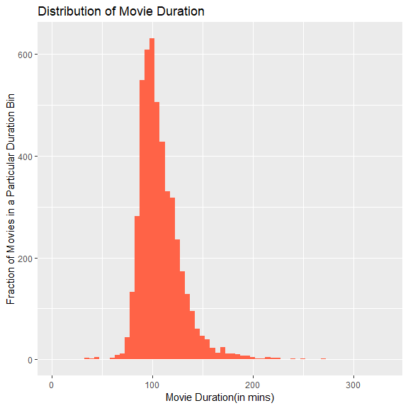

Here we used ```y=..density..```, since density is calculated statistic. The default statistic is ```count``` for histogram. But for calculated statistic, we need two dots. The distribution looks roughly right skewed, indicating a very long tail. Lets check the summary stats.


```
##    Min. 1st Qu.  Median    Mean 3rd Qu.    Max.    NA's 
##     7.0    94.0   104.0   108.1   118.0   330.0      12
```
The mean is slightly higher than median, so we can safely conclude it to be right skewed. It can also be considered relatively normal, since the mean is not too much off the median. As expected there are very few movies of duration greater than 300 minutes. Let us find the longest and the shortest movie.


```r
movie_select%>%
  filter(!is.na(movie_select$duration))%>%
  filter(duration==max(duration)| duration==min(duration))%>%
  select(movie_title,duration)
```

```
##           movie_title duration
## 1 Blood In, Blood Out      330
## 2           The Touch        7
```
So ```Blood In,Blood Out``` is the longest movie with length of 330 minutes,refer to(https://en.wikipedia.org/wiki/Blood_In_Blood_Out). At the same time, ```The Touch``` is the shortest movie, as per the dataset. 

### Distribution of Content Rating

Since ```content_rating``` is a factor variable, bar graph is a suitable choice. Before we plot this variable, let us do some restructuring. After 1972, the ```M```, ```GP``` movie ratings got replaced by ```PG```. We are going to replace these values. Similarly after 1990, the ```X``` rating was replaced by ```X```. Moreover after  1996, the movie ratings ```Approved```,```Not Rated```,```Passed```,```TV-14```,```TV-G```,```TV-PG```, ```Unrated``` got replaced by ```R```.


The above code makes sure that we are left with only five levels now for ```content_rating```.


Most of the movies are rated ```R```, followed by ```PG-13```, and ```PG```. Almost 255 movie titles are missing information regarding content rating. 

### Distribution of Language
This is an interesting feature in the dataset. It gives an idea of the popularity of movie languages. Being  a factor variable, its distribution will be studied using bar chart.


As expected, **English** is the dominating language, followed by **French** and **Hindi**. This information will be used later to study the language trend across countries, time, etc. Aside, we observe the 10 most popular  ```languages```.


The number of ```English``` movies heavily outnumber other languages.

### Distribution of Country
Next, we look at the count of movies in each ```country```. Similar to language, it is a categorical variable.

In this dataset, highest number of movies are produced in ```U.S.A```, close to 3500. In the bivariate anlaysis, we will look at different characteristics, including ```language```,```content_rating```, etc. in relation to countries. Lets look at the top 10 countries with highest number of movies.


```
## # A tibble: 10 x 2
##    country   movie_count
##    <fct>           <int>
##  1 USA              3627
##  2 UK                418
##  3 France            152
##  4 Canada            119
##  5 Germany            94
##  6 Australia          51
##  7 India              34
##  8 Spain              33
##  9 China              28
## 10 Japan              21
```

As a side blurb, we will look at the movie count over the world map. For this, we need to import the world map data. 


```r
world_map <- map_data("world")

head(world_map)
```

```
##        long      lat group order region subregion
## 1 -69.89912 12.45200     1     1  Aruba      <NA>
## 2 -69.89571 12.42300     1     2  Aruba      <NA>
## 3 -69.94219 12.43853     1     3  Aruba      <NA>
## 4 -70.00415 12.50049     1     4  Aruba      <NA>
## 5 -70.06612 12.54697     1     5  Aruba      <NA>
## 6 -70.05088 12.59707     1     6  Aruba      <NA>
```

Next, we plot the data on the world map.
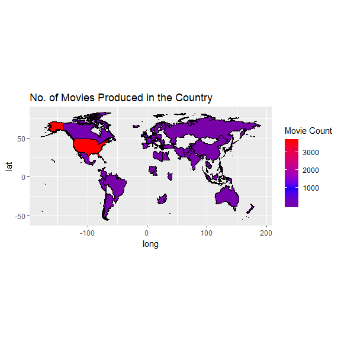

### Distribution of Budget
It will be interesting to observe the budget distribution. We can observe the count of movies having sufficiently high budget. Before plottng it, we will convert the budget to millions.


The distribution is right skewed, as expected. Most of the movies have a low budget. Out of curiosity, we will find the movie with highest budget.


```
##   movie_title Budget_millions
## 1    Steamboy         2127.52
```

### Distribution of Gross Income

Lets observe the distribution of Income generated by the movies. Similar to budget, we will convert the gross income to millions.


The distribution is right skewed, i.e. very few movies generate high income, say more than 400 millions. Next, we identify the movie generating the highest income.


```
##   movie_title gross_income
## 1      Avatar     760.5058
```

We eliminate original variables, Budget and Gross to avoid redundancy.


### Distribution of IMDB Score
The IMDB rating is a criteria to classify the popularity of the movie. It is based on the number of votes receieved by a user. Quickly check the summary of this field.


```
##    Min. 1st Qu.  Median    Mean 3rd Qu.    Max. 
##   1.600   5.800   6.500   6.413   7.200   9.300
```
Checking the summary, the distribution is expected to be relatively normal, also observed in the histogram.


As  a side blurb, we want to compare distribution of imdb score for each level of content  rating. Since content rating is categorical variable, and imdb score is continuous, we can use ```geom_freqpoly()```.


### Distribution of User votes

Next, we observe the distribution for number of votes a movie has received. Being a numeric variable, histogram is a suitable choice. Lets scale the number of votes, i.e. convert it to thousands.


Very few movies have number of votes larger than 1 million, indicating a right skewed distribution. As a side blurb, we identify the movie with the highest number of votes.


```
##                movie_title num_voted_users
## 1 The Shawshank Redemption        1689.764
```
Approximately, the movie ```The Shawshank Rdemption``` gathered 1689.764 votes.

### Distribution of Movie Facebook Likes
Apart from number of user votes, number of facebook likes can also help to assess the popularity of the movie. Checking its summary, we observe significant right skewness.

```
##    Min. 1st Qu.  Median    Mean 3rd Qu.    Max. 
##       0       0     159    7426    2000  349000
```

Being an integer, we choose a histogram to study its distribution.


As expected the original distributon is right skewed. Therefore we look at log of the data, and it is easy to see the bimodal behavior. Therefore, we have a good chunk of movies (~155) with number of facebook likes close to 1000, and at the same time we have significant number of movies(~120) with number of facebook likes around 10000. Next, we idenify the movie with highest number of facebook likes.


```
## [1] Interstellar
## 4794 Levels: #Horror [Rec] [Rec] 2 ... Zulu
```

The movie ```Interstellar``` has got the highest number of facebook likes, close to 349000.

### Distribution of Movie Director

This distribution can help us to identify how many movies are directed by a given director. Being a categorical variable, we will look at the bar graph.


Because of too much data, the figure is not so informative. On a side note, we look at the top 10 directors, who have directed most of the movies.


```
## # A tibble: 10 x 2
##    director_name     count_movie
##    <fct>                   <int>
##  1 Steven Spielberg           26
##  2 Woody Allen                22
##  3 Martin Scorsese            20
##  4 Clint Eastwood             18
##  5 Ridley Scott               16
##  6 Spike Lee                  16
##  7 Renny Harlin               15
##  8 Steven Soderbergh          15
##  9 Oliver Stone               14
## 10 Tim Burton                 14
```

The list is led by the icon ```Steven Spielberg``` followed by other legends including ```Client Eastwood``` and ```Woody Allen```. In the multivariate analysis section, we will look at their distribution as per language. 

### Distribution of Facebook likes received by Director
Next, we judge the popularity of the movie's director. We will look at the histogram for the variable, ```director_facebook_likes```.


```
##    Min. 1st Qu.  Median    Mean 3rd Qu.    Max. 
##     0.0     7.0    48.0   686.8   189.8 23000.0
```

The distribution is heavily skewed, for sure it is due to few heavily popular directors. We will take logarithm (base 10) to have  a reasonable size of this variable. 


After taking log(base10), as expected the right skewed data looks approximately normal, but still bimodal. Let's find the 10 most popular director, as per facebook likes.


```
##           director_name director_facebook_likes
## 1  Joseph Gordon-Levitt                   23000
## 2     Christopher Nolan                   22000
## 10        David Fincher                   21000
## 20       Derick Martini                   20000
## 21         Kevin Spacey                   18000
## 22    Denzel Washington                   18000
## 25      Martin Scorsese                   17000
## 45    Quentin Tarantino                   16000
## 47       Clint Eastwood                   16000
## 71            Tom Hanks                   15000
```

The great icon, ```Steven Spielberg``` does not appear in the top 10 list, since most of his notable movies were old, and facebook started in 2006.

### Distribution of First Actor
There are 2035 distinct values for first actor in the data, therefore bar graph will be almost not legible. So, it will be more useful to look at 10 actors with highest movie count.


```
## # A tibble: 10 x 2
##    actor_1_name      count
##    <fct>             <int>
##  1 Robert De Niro       48
##  2 Johnny Depp          36
##  3 Nicolas Cage         32
##  4 Denzel Washington    29
##  5 J.K. Simmons         29
##  6 Matt Damon           29
##  7 Bruce Willis         28
##  8 Harrison Ford        27
##  9 Liam Neeson          27
## 10 Robin Williams       27
```
As seen, ```Robert De Niro``` has  starred as the leading actor in highest number of movies, followed by ```Johnny Depp``` and ```Nicholas Cage```. Similarly, we can find leading actors with the lowest movie count.


```
## # A tibble: 10 x 2
##    actor_1_name        count
##    <fct>               <int>
##  1 50 Cent                 1
##  2 A.J. Buckley            1
##  3 Óscar Jaenada          1
##  4 "Ã\u0081lex Angulo"     1
##  5 Aaliyah                 1
##  6 Aasif Mandvi            1
##  7 Abigail Evans           1
##  8 Abigail Spencer         1
##  9 Adam Arkin              1
## 10 Adam LeFevre            1
```

### Distribution of Leading Actor Facebook Likes
To begin with, we will look at the summary.


```
##     Min.  1st Qu.   Median     Mean  3rd Qu.     Max.     NA's 
##      0.0    612.5    989.0   6609.4  11000.0 640000.0        7
```
As seen for the variable, ```director_facebook_likes```, the distribution is right skewed. Lets check the histogram.


The distribution is bimodal, and is also right skewed. Let us look at the ```log``` of the continuous variable, ```actor_1_facebook_likes```. 

As expected, the distribution of ```log()``` data is relatively normal, and bimodal. For example, there are 1271 observations in the data where ```actor_1_facebook_likes``` lies between ```3-0.125``` and ```3+0.125```. It should be noted that  this interval corresponds to the interval ```10^c(2.875,3.125)```. Next, we will identify the leading actor with highest number of facebook likes.


```
##       actor_1_name actor_1_facebook_likes
## 1    Darcy Donavan                 640000
## 2     Matthew Ziff                 260000
## 5     Krista Allen                 164000
## 7  Andrew Fiscella                 137000
## 9    Jimmy Bennett                  87000
## 17  Michael Joiner                  77000
## 18  Robin Williams                  49000
## 45     Craig Stark                  46000
## 46     Muse Watson                  45000
## 51      Tim Holmes                  44000
```

### Distribution of Second Actor
Similar to the leading actor, we will identify the 10 second actors with highest movie count.


```
## # A tibble: 10 x 2
##    actor_2_name        count
##    <fct>               <int>
##  1 Morgan Freeman         18
##  2 Charlize Theron        14
##  3 Brad Pitt              13
##  4 Meryl Streep           11
##  5 Adam Sandler           10
##  6 James Franco           10
##  7 Bruce Willis            9
##  8 Scott Glenn             9
##  9 Will Ferrell            9
## 10 Angelina Jolie Pitt     8
```

```Morgan Freeman``` is the second actor with highest movie count, followed by ```Charlize Theron``` and ```Brad Pitt```.

### Distribution  of Facebook Likes for Second Actor

First, we will look at the summary of the variable, ```actor_2_facebook_likes```.


```
##    Min. 1st Qu.  Median    Mean 3rd Qu.    Max.    NA's 
##       0     279     595    1650     919  137000      10
```

Checking the mean and median, we conclude that it is right skewed. Lets check with the histogram.


Similar to popularity of leading actor, this distribution is bimodal as well as right skewed.

### Distribution of Actor 3 Name
Similar to leading actor, we will identify the most popular ```third actors```.


```
## # A tibble: 10 x 2
##    actor_3_name        count
##    <fct>               <int>
##  1 Steve Coogan            8
##  2 Jon Gries               7
##  3 Robert Duvall           7
##  4 Sam Shepard             7
##  5 Stephen Root            7
##  6 Anne Hathaway           6
##  7 Ben Mendelsohn          6
##  8 Bruce McGill            6
##  9 Clifton Collins Jr.     6
## 10 Hope Davis              6
```

### Distribution of Actor_3_facebook_likes

We observe the summary of the variable, ```actor_3_facebook_likes```.


```
##    Min. 1st Qu.  Median    Mean 3rd Qu.    Max.    NA's 
##     0.0   132.0   367.5   638.6   636.0 23000.0      18
```
Since mean exceeds the median, it is right skewed distribution, as seen in the following figure.


<!-- ###Distribution of Movie Genre

Since ```Genre``` is a categorical variable, we observe the bar graph.


There are 362 distinct levles for the field ```genre```, which is too much blurred hence not so infomative. So we will plot the top 10 most popular genres.


Next, we represent this data using bar graph. First, transform the ```genre``` to factor variable.

As expected, ```Drama``` is the most popular genre, followed by ```Comedy``` and ```Thriller+Drama```. It should be noted that there are 282 movies, which get classified as both ```Thriller``` and ```Drama```. -->

### Recap
Univariate analysis was conducted in this section to get some overview of the variables. The numeric variables, ```budget``` and ```income``` as expected are right skewed. Since very few movies are costly or generate huge revenue, right skewness is expected. At the same time, recently there has been a surge in number of movies; the distribution of ```year``` is left skewed. On the other hand, the number of facebook likes for director and actors is right skewed, which indicates very few popular actors on facebook.

## Bivariate Analysis
Earlier, we performed univariate analysis of the data. Now we plan to observe two variables at a time, i.e. Bivariate Analysis.


### Income Generated Across Different Countries
In this section, we analyze the distribution of income generated across diferent countries. Since ```country``` is a categorical variable, ```gross_income``` is numeric, therefore boxplot is a suitable choice. In the univariate section, we saw that top 10 countries with highest number of movies are ```USA```,```UK```,```France```,```Canada```,```Germany```,```Australia```,```India```,```Spain```,```China```, and ```Japan```.First, we will filter the data for these countries. Next, we observe the boxplot.


We notice that for every ```country```, there are outliers in distribution of ```income```. Since most of the movies are made in ```USA```, it has highest number of outliers. Next, since mean exceeds the median for most of the countries, the income distribution is right skewed. 
Looking at the boxplot, we see significant outliers for countries, ```China``` and ```Japan```. We should identify the movies for which the gross income is much greater than normal trend. To this end, we will first filter the dataset, for ```Japan``` and ``` China```, followed by selecting top 2 movies in terms of gross income generated.

```
## # A tibble: 4 x 3
## # Groups:   country [2]
##   movie_title                        gross_income country
##   <fct>                                     <dbl> <fct>  
## 1 Mission: Impossible - Rogue Nation        195.  China  
## 2 The Last Emperor                           44.0 China  
## 3 The Secret Life of Pets                   324.  Japan  
## 4 Trainwreck                                110.  Japan
```
In ```China``` the two highest revenue generating movies are Mission:Impossible-Rogue Nation and The Last Emperor. Similarly for ```Japan```, top 2 movies are The Secret Life of Pets and Trainwreck.

### Budget Distribution Across Countries
Now we analyze the distribution of movie budget for each country. Since ```country``` is a categorical variable, and ```Budget_millions``` is numeric, we will use the boxplot. 

From the boxplot, it can be observed that for countries like ```China```,```India```, ```Japan```, and ```Spain``` the outliers are very significant. Let us find the highest budget movie for these countries.


```
## # A tibble: 4 x 3
## # Groups:   country [4]
##   movie_title            Budget_millions country
##   <fct>                            <dbl> <fct>  
## 1 Red Cliff                         554. China  
## 2 Kabhi Alvida Naa Kehna            700  India  
## 3 Steamboy                         2128. Japan  
## 4 Tango                             700  Spain
```

Since I am from India, I would like to dig a bit deeper into the stats for the movie ```Kabhi Alvida Naa Kehna```.

The leading actor in this movie is ```Shahrukh Khan```, a Bollywood icon. As a side blurb, it will be interesting to see popular Bollywood actors(in lead role), using number of facebook likes as the criteria. It should be noted that this is based on *this* particular dataset. It might not reflect the actual figures.


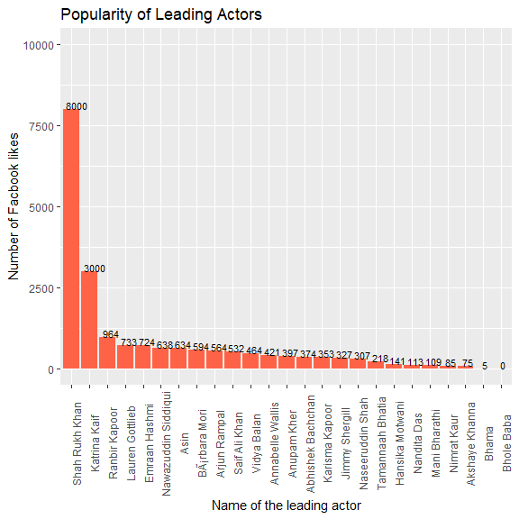

We observe that ```Shahrukh``` and ```Katrina``` lead the chart way ahead of other leading actors. Next, it will be interesting to see language distribution across top 10 countries.

### Language Distribution Across Countries
We need to know the popularity of language in a given country. The focus will be on the top 10 countries, with highest number of movies. We plan to do the grouping on two variables; ```country``` and ```language```.


Next, we get a bar chart to get the number of movies in a particular language, faceted  by country.


```
##    Min. 1st Qu.  Median    Mean 3rd Qu.    Max. 
##    1.00    1.00    1.00   91.54   12.00 3600.00
```
The count variable is heavily skewed with 75 percent of values being less than 12 but maximum value is 3600. We found that in ```US``` the number of movies made in English is 3600. If we ignore that record, and look at the new plot.

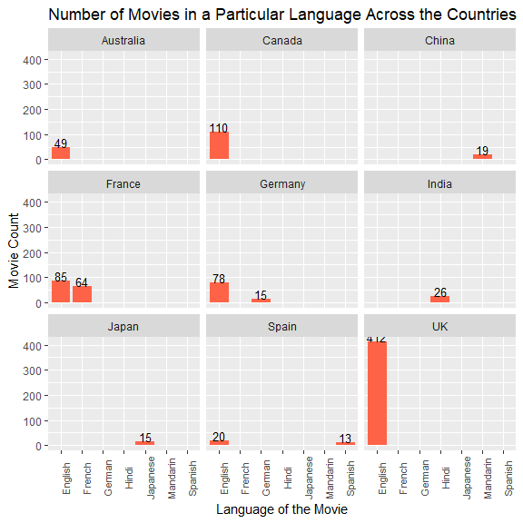
Apart from ```India``` and ```China```, for every country, most of the movies are made in English. As expected, highest number of movies made in ```India``` are in ```Hindi``` and ```Mandarin``` for ```China```. 

### Budget Analysis Across Time
Next, we will compare the budget for recent movies and that of older movies. To this end, we define a new variable, ```movie_recent```. We will classify the movies as 

* **New** : Released after 2000
* **Medieval** : Before 2000 but later than 1970
* **Old** : Before 1970.


The next step is to compare the mean yearly budget as time progresses.

```
## # A tibble: 3 x 2
##   movie_recent mean_budget
##   <chr>              <dbl>
## 1 Medieval           28.2 
## 2 New                38.2 
## 3 Old                 4.04
```
Since distribution for ```Budget_millions``` is right skewed, it will be better to compare the median.


```
## # A tibble: 3 x 2
##   movie_recent median_budget
##   <chr>                <dbl>
## 1 Medieval             17   
## 2 New                  20   
## 3 Old                   2.54
```

We see that the budget has increased significantly as time progresses. For example, almost 50 percent of the movies released after the year 2000 had a budget more than 20 millions. This is a significant increase as compared to 2 millions for older movies. As a side blurb, we identify the highest budget movie in all three categories. This can be achieved using the ```top_n()``` function from ```dplyr()```.


```
## # A tibble: 3 x 4
## # Groups:   movie_recent [3]
##   movie_title Budget_millions movie_recent title_year
##   <fct>                 <dbl> <chr>             <int>
## 1 Cleopatra              31.1 Old                1963
## 2 Steamboy             2128.  New                2004
## 3 Akira                1100   Medieval           1988
```

Let's try to look at this change in budget using a different perspective. Since budget is changing with time, line graph will be a suitable option.
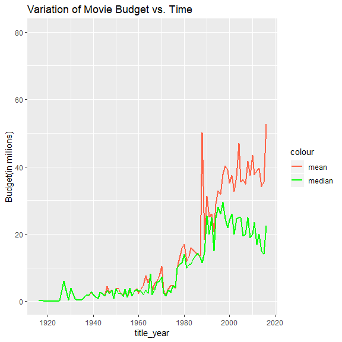

We see that the behavior of mean as well as median of the budget is very noisy. But overall it is increasing with time. Before the year 2000, the mean budget is the highest at 50 millions. It will be worthwhile identifying that ```year``` and looking at the movies produced in that year.


```
## # A tibble: 6 x 2
##   title_year mean_budget
##        <int>       <dbl>
## 1       2016        52.6
## 2       1988        50.2
## 3       2004        46.9
## 4       2010        43.4
## 5       2008        41.6
## 6       1998        40.3
```
So its the year 1988, when the mean budget is the highest in pre-2000 period. We filter for movies produced in that year.


```
## [1] 30  3
```

Therefore, we have 30 movies as per this dataset, that were released in year 1988. To identify the most costly movie, we can just look at the top 5 of them.

```
##    movie_title Budget_millions title_year
## 1        Akira            1100       1988
## 2    Rambo III              63       1988
## 3     Scrooged              32       1988
## 4 Midnight Run              30       1988
## 5     Die Hard              28       1988
## 6     Rain Man              25       1988
```

Great! the movie ```Akira``` released in  1988, had an estimated budget of 1100 millions, which is enough to pull the mean to 50 millions, despite the fact that rest all movies did cost less than 100 millions.
Similar analysis can be done to identify the highest income generating movies.

### Gross Income Analysis Across Time
Similar to ```Budget```, we analyze the variation of ```Gross Income``` with time. We compute the statistical summaries, ```mean``` and ```median``` of the gross income as time progresses.


It is easy to notice that mean income generated was almost same as median in earlier years. This can be attributed to small number of movies produced earlier as compared to number of movies produced nowadays. After the year 1965, the mean value exceeds the median income, hence we expect right skewness in the distribution of ```gross_income```. Moreover the mean income generated nowadays is much lower than earlier. This can hapen due to large number of movies produced nowadays and most of them don't do so good at the box office. Out of curiosity let's check how much income has been generated by the movie ```Akira``` the highest budget movie in year 1988. 


```
## [1] 0.439162
```

Despite being the costliest movie in the year 1988, `Akira` could earn only 0.45 millions in gross. During the period 1935-1940, the mean ```gross_income``` is quite high, close to 200 millions. To find that movie, we will compute the mean income for a given year using ```group_by```.


```
## # A tibble: 6 x 2
##   title_year mean_income
##        <int>       <dbl>
## 1       1937        185.
## 2       1975        124.
## 3       1939        110.
## 4       1977        106.
## 5       1973        103.
## 6       1942        103.
```

Next, we check the movies produced in the year 1937.

```
##                       movie_title gross_income title_year
## 1 Snow White and the Seven Dwarfs     184.9255       1937
## 2           The Prisoner of Zenda           NA       1937
```
Therefore, ```Snow White and the Seven Dwarfs``` is  the highest earning movie in 1937. It earned a gross income of 184.92 millions.

<!--###Genre Count vs. Time-->
<!--Another question we can answer is, whether the movie count for a particular ```genre``` changes with respect to time. It might be possible that count of movies of a particular genre were produced is larger numbers as compared to nowadays. It will be useful to plot the line graph depicting variation in movie count for  a particular genre as time progresses.
Number of distinct genres is 0.
It will be difficult to plot 362 line charts in a given plot, hence, we should look at top 10 genres only.
Therefore, we are going to look at the variation of movie count for above 10 genres. -->


<!--For all ```genre```, the movie count has increased significantly, but it is noisy. Moreover, number of movies for each ```genre``` is decreasing closer to 2020.-->

### Variation of Movie Count for Content Rating w.r.t Time
Similar to ```genre```, does movies of ```content_rating``` also vary wih time.

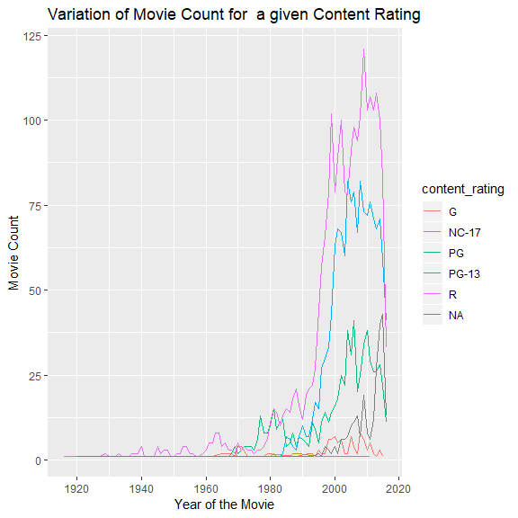

The movie count for every content rating is behaving  noisily with respect to time. In the post 1980 period, number of movies increases for every content rating. Number of movies is highest for the content rating, ```R``` followed by ```PG-13``` and ```PG```. As time approaches 2020, the number of movies is decreasing for each content rating. Interestingly, the number of movies rated ```NC-17``` is the lowest throughout the entire period.


### Variation in Movie Duration With Respect To Time
Another attribute, which could change with time is the length of the movie. Since it varies with time, we will use line plot.


It is interesting to see that overall, newer movies are shorter than older movies. In the range 1960-1980, the mean duration is at the peak, close to 160 mins. Let's try to identify which movie is causing the average to be so high.


```
## # A tibble: 10 x 2
##    title_year mean_duration
##         <int>         <dbl>
##  1       1963          154.
##  2       1925          151 
##  3       1939          149.
##  4       1961          146.
##  5       1927          145 
##  6       1946          145.
##  7       1954          144 
##  8       1962          140.
##  9       1965          139.
## 10       1959          137.
```

Next, we filter for the movies released in the year 1963 and identify the longest movie in that year.


```
##                       movie_title title_year duration
## 1                       Cleopatra       1963      251
## 2 It's a Mad, Mad, Mad, Mad World       1963      197
## 3                The Great Escape       1963      172
## 4               55 Days at Peking       1963      154
## 5                       Tom Jones       1963      121
## 6           From Russia with Love       1963      115
## 7                             Hud       1963      112
## 8                  Donovan's Reef       1963      109
```

Therefore, ```Cleopatra``` is main contributor to the high average of movie duration in the year 1963.

### Aspect Ratio vs. Time
Is ```aspect ratio``` a function of time? The relationship between height and width of the image might be changing with time.


The mean ```aspect_ratio``` has an upward trend, as time progresses. The behavior is quite noisy.

### Distribution of Gross Income w.r.t Content Rating
Next, we observe the effect of ```content_rating``` on ```gross_income```. Since ```content_rating``` is categorical, and ```gross_income``` is numeric, boxplot is suitable choice.


We see that the ```gross_income``` is highest for ```content_ratings```; ```R```,```PG```, and ```PG-13```. Moreover, these content ratings exhibit lots of variation for ```gross_income```. On the other hand, variation is least for content ratings, ```GP```,```M```,```G```. Moreover, distribution is right skewed for following content ratings, ```G```, ```PG```, ```PG-13```, and ```R```.  

### Distribution of Budget With Respect to Content Rating
Similar to ```Gross Income```, we study the behavior of ```Budget``` as function o Content Rating. Boxplot is  a suitable choice.


For the content ratings; ```PG-13```,```PG```, and ```R```, the budget is widely spread and has significant outliers. We see one movie rated ```PG-13```, that is incredibly costly. We will identify that particular movie.


```
## # A tibble: 6 x 3
##   content_rating movie_title            max_budget
##   <fct>          <fct>                       <dbl>
## 1 PG-13          Steamboy                    2128.
## 2 R              Akira                       1100 
## 3 PG             Godzilla 2000               1000 
## 4 PG-13          Tango                        700 
## 5 R              Kabhi Alvida Naa Kehna       700 
## 6 R              Red Cliff                    554.
```
Therefore ```Steamboy``` is the costliest ```PG-13``` movie with a budget of 2127 billions. Out of curiosity, lets check the gross income earned by the costliest movies of these 3 genres.


```
##     movie_title gross_income
## 1      Steamboy     0.410388
## 2         Akira     0.439162
## 3 Godzilla 2000    10.037390
```
Despite being the costliest ```PG-13``` movie, ```Steamboy``` could not generate enough revenue, it earned merely 0.41 millions. Similar figures for ```Akira```. But ```Godzilla 2000``` did really good at the box office.

### Relation Between IMDB Score and Number of User Votes
It is highly likely that the movie which has received lots of user votes has a  higher IMDB score. It wil be useful to get a scatterplot, since both are numeric in nature. Since, these two variables are on different scales, we normalize them and sketch the scatterplot.


Let's check the correlation coefficient. Since the relation seems nonlinear between these variables, we expect very low correlation coefficient. It seems that relationship is logarithmic in nature. Moreover, it is not obvious that higher IMDB score is guaranteed by high number of user votes. For smaller number of user votes, we observe lots of variation in the IMDB score.


```
## [1] 0.4280672
```

### IMDB Score for Popular Directors

In the univariate analysis, we found the top 10 directors, in terms of facebook likes. Let's see, whether the IMDB score on an average is higher for these top 10 directors.


```
## # A tibble: 10 x 2
##    director_name        mean_score
##    <fct>                     <dbl>
##  1 Christopher Nolan          8.43
##  2 Clint Eastwood             7.2 
##  3 David Fincher              7.75
##  4 Denzel Washington          7.45
##  5 Derick Martini             4.5 
##  6 Joseph Gordon-Levitt       6.6 
##  7 Kevin Spacey               6.4 
##  8 Martin Scorsese            7.66
##  9 Quentin Tarantino          8.2 
## 10 Tom Hanks                  6.5
```

We see that the lowest average ```imdb_score``` obtained by a popular director is 4.5, and the director is Derick Martini. Next question, we want to answer is, do directors with large following on facebook are the only ones with high IMDB rating. What about the other directors? For example Steven Spielberg does not have many followers on facebook becuase he is an old time director.


```
## # A tibble: 20 x 2
##    director_name           mean_score
##    <fct>                        <dbl>
##  1 Cary Bell                      8.7
##  2 Mitchell Altieri               8.7
##  3 Sadyk Sher-Niyaz               8.7
##  4 Charles Chaplin                8.6
##  5 Mike Mayhall                   8.6
##  6 Damien Chazelle                8.5
##  7 Majid Majidi                   8.5
##  8 Raja Menon                     8.5
##  9 Ron Fricke                     8.5
## 10 Asghar Farhadi                 8.4
## 11 Bill Melendez                  8.4
## 12 Catherine Owens                8.4
## 13 Jay Oliva                      8.4
## 14 Marius A. Markevicius          8.4
## 15 Moustapha Akkad                8.4
## 16 Rakeysh Omprakash Mehra        8.4
## 17 Richard Marquand               8.4
## 18 Robert Mulligan                8.4
## 19 S.S. Rajamouli                 8.4
## 20 Fritz Lang                     8.3
```
So the average IMDB score for not so popular directors is around 8.7, which is close to the imdb score obtained by directors, who are highly popular on facebook. Therefore, director's popularity on facebook does not necessarily imply higher imdb score for that director's movie.

### Relation Between Number of Movie Facebook Likes and IMDB Rating

We saw earlier that there is no linear relation between number of user votes a movie has recieved and the imdb rating. Now let us check relation between the imdb rating and number of facebook likes received by the movie. 


There does not exist linear relation between these variables, confirmed by the correlation coefficient. Movies with higher number of facebook likes do have higher IMDB score. But the behavior of movies with lower facbook likes is very erratic and no definite conclusion can be derived. Look at the bimodal distribution as we saw during the univariate analysis of number of facebook likes received by a movie. On a side note, lets take log of the number of facebook likes and plot against IMDB score.


Taking log (to base 10) of number of facebok likes recieved does not depict an exactly linear relationship. We see the data has been divided into two chunks(as seen during the univariate analysis) and there is a slight upward trend in the pattern of imdb rating as we move from one chunk to another chunk. So, we can keep log of number of facebook likes as a possible predictor in the prediction model.

<!--###Performance of Profit vs Budget for a Movie
Since, both the variables are numeric, scatterplot is a suitable choice. Standardization might not be needed, since both variables are in similar scale, in millions.-->


<!--As expected few movies with very high budget, the profit is negative indicating very low gross income generated. Since most of the movies have been released after 2000, we filter the data for the period 2000 through 2016.-->


<!--We see that Profit is increasing with Budget after the year 2000. Costlier the movie, more money it is making.-->

<!--###Content Rating vs. Profit
Do movies of particular ```content_rating``` earn more profit? Boxplot will be useful to depict the relation between categorical variable, ```content_rating``` and ```Profit```, numeric variable.-->


<!--We observe few movies incurring heavy loss for content ratings, ```PG```,```PG-13```, and ```R```. We identify these movies, that have earned the least profit.-->


### Content Rating and IMDB Score
In this section, we explore the relation between ```content_rating``` and ```imdb_score```. Since ```content_rating``` is categorical, and ```imdb_score``` is numeric; boxplot will help to assess the variation.


The mean IMDB score is comparable across all content ratings, with ```R``` movies leading by a small fraction. Moreover, the distribution of IMDB score is normal for ```R``` movies, and is left skewed for other types of ratings. For the movies; ```R```,```PG```, and ```PG-13```, we observe outliers on the lower end, the scores less than $Q1-(1.5 \times IQR)$. The presence of outliers can be attributed to large number of movies of that category. Since mean IMDB score is comparable across different content ratings, it can't be concluded that content rating is a decisive factor in predicting IMDB score.

As a side blurb, we analyze relation between imdb score and content rating in a different way. First, convert imdb score into categorical variable using the concept of ```breaks```, and define a new variable; ```score_category```. 


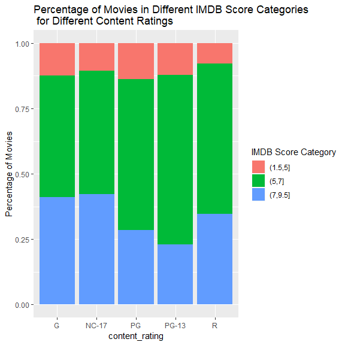
 Therefore, movies with content raings ```G``` and ```NC-17``` have highest percentage of movies in the bracket (7,9.5]. Hence content rating should be considered as a factor in the model to predict IMDB rating.
 
<!--###Profit vs. IMDB Score
Movies that earned huge profit supposedly should have higher IMDB score. Since we have categorized IMDB score, we can use boxplot to compare profit for various levels of imdb score category. -->


<!--We are unable to see much difference in imdb scores across different score categories. Few movies with IMDB score in the range $(7.95]$ earn lower profit than movies in the category $(1.5,5]$. -->

### Revenue Generated vs. IMDB Rating
Another possible factor that might affect IMDB rating is revenue generated by the movie.

We observe a slight upward trend in the income generated, for higher IMDB score category.

### Movie Duration vs. IMDB Rating
Does shorter or longer movies score higher on IMDB category? First, we look at the correlation coefficient.


```
## [1] 0.3436603
```
 
As a side blurb, let us look at the box plot between score catgory and movie duration.

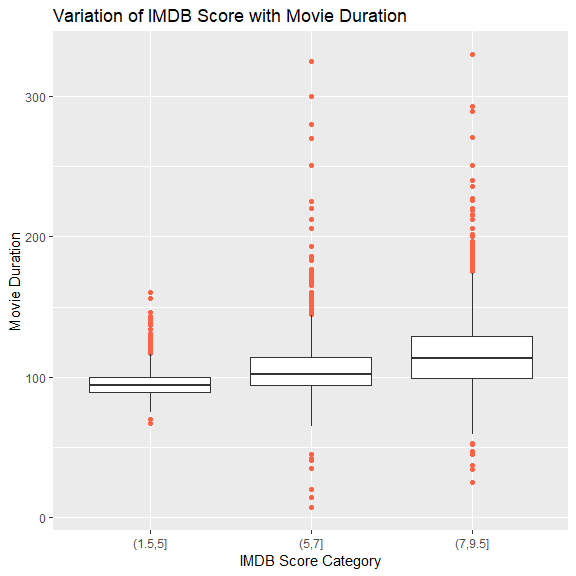
There is a slight upward trend in the median duration of the movies, i.e. for higher score category, the movies are bit longer.

### Variation of IMDB Score With Time
Were older movies rated better as compared to contemporary movies? It is possible that due to some classics, IMDB scores were generally higher earlier.


The boxplot is very cluttered. Since it is a function of time, line plot can be used to observe the mean/median IMDB score.

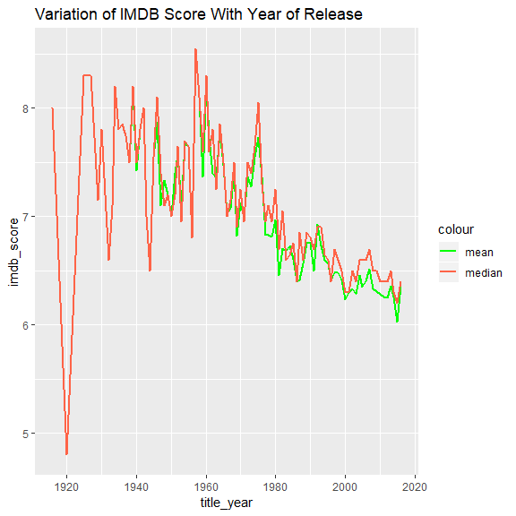
So, the answer is yes. The year of release does affect IMDB score. We see that the score is decreasing with time. Let us define a new  variable, movie_age,i.e. that is the difference between 2016(the most recent release year in the data) and year of release.


```r
movie_select <- movie_select %>%
  mutate(movie_age=2016-title_year)
```

### Recap
As a recap, we performed Bivariate Analyis on the movies datase. Here are the highlights:

* Average IMDB score is relatively constant across different content ratings. For the movies rated, ```R```,```PG``` and ```PG-13```, there is significant variation in IMDB score.

* During the period 2000-2016, the relation between Budget and profit earned is almost linear.

* There does not exist linear relation between IMDB score and number of facebook likes received by a movie. On the contrary, the relationship looks roughly logarithmic in nature.

* Comparing the mean IMDB score, we do not see a direct dependency between the IMDB score and popularity of movie director.

* Similar to number of facebook likes, number of user votes also does not decide IMDB score decisively. The relation between IMDB score and number of votes received is roughly logarithmic.

* In ```India```, ```Kabhi Alvida Na Kehna``` is the costliest movie at 700 millions. Moreover, its lead actor Shahrukh Khan is the most popular Bollywood actor on facebook. 

* The revenue generated by a movie can be taken as a possible predictor while predicting the IMDB score. 

## Multivariate Analysis
In this  section, we explore the movies data, considering more than two variables at a given time.

### Variation of Movie Count for Different Content Ratings across Countries 
First, we analyze the variation in movie count for a given content rating with respect to time across different countries. We focus on the top 10 countries with the highest number of movies.

After the year 1990, there has been tremendous growth in number of movies, for all types of content ratings. As we saw earlier, U.S registers the highest number of movies produced, followed by U.K. Number of movies rated ```R``` is the highest throughout the post 1900 period. But the behavior is quite noisy. Next to ```R``` rated movies, we have ```PG-13``` movies, which is closely following the ```R``` rated movies. Number of ```PG``` rated movies is very small as compared to ```R``` and ```PG-13```, but the behavior is noisy.  

### Revenue Generated for Different Content Ratings Across Countries
Next, we observe  the distribution of generated revenue for each content rating, across various countries. We focus on the top 10 countries where highest number of movies are produced. Here country and content ratings are categorical variables, whereas revenue is numerical, therefore boxplot is a suitable choice. 


Across each country, outliers in gross income are observed mostly for three content ratings;  ```R```, ```PG```, and ```PG-13```. Since USA registers highest number of movies, most of the outliers are observed for it. We identify the highest income generating movie and its corresponding content rating for each country. 


```
## # A tibble: 10 x 4
## # Groups:   country [10]
##    movie_title                        gross_income country   content_rating
##    <fct>                                     <dbl> <fct>     <fct>         
##  1 Avatar                                    761.  USA       PG-13         
##  2 X-Men: The Last Stand                     234.  Canada    PG-13         
##  3 The Jungle Book                           363.  UK        PG            
##  4 Mission: Impossible - Rogue Nation        195.  China     PG-13         
##  5 Stuart Little                             140.  Germany   PG            
##  6 The Secret Life of Pets                   324.  Japan     PG            
##  7 The Lego Movie                            258.  Australia PG            
##  8 Midnight in Paris                          56.8 Spain     PG-13         
##  9 Taken                                     145.  France    PG-13         
## 10 Monsoon Wedding                            13.9 India     R
```

### Relation Between IMDB Rating and Revenue Generated for Different Content Ratings
Is it true that there is interaction between revenue generated and content rating while predicting the IMDB score. To this end, we compute the correlation between revenue generated and imdb score for each content rating and generate scatterplot for imdb score vs. gross income for each value of content rating. Here, we use the concept of ```glue``` from ```stickylabeller``` package.


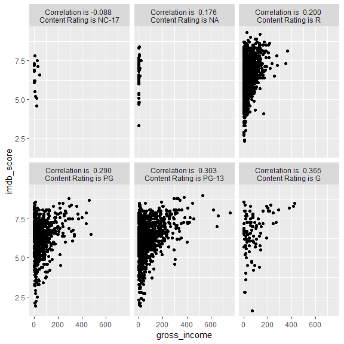

We do not see any significant linear correlation here. In other words, we can rule out interaction between content rating and revenue generated while predicting the imdb score. To conclude, overall higher gross income across each content rating generates higher imdb score.

### Interaction of Country and Language for IMDB Score Prediction
In this subsection, we try to answer the following question; is it true that for a given country movies in a particular language have higher IMDB score. We will focus our analysis on top 10 countries as well as top 10 movie languages as per movie counts. We obtain the movie percentage in a given IMDB category for a given language across countries. To this end, we facet by country, and look at stacked bar chart to compute the percentage of movies in an IMDB bucket, having language on x-axis.


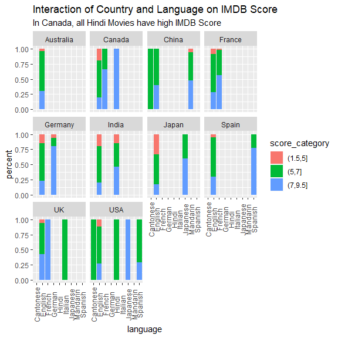

It is obvious that there is some interaction between country and language. For instance, in Spain, Spanish movies have the highest proporion of movies with high IMDB score. Therefore, we propose to include interaction between country and language while predicting the IMDB score.

#### Note
As seen in univariate analysis, most of the movies are made in U.S. Therefore, we plan to exclude country as a predictor in the model. Similarly for language, most of the movies are produced in English; we exclude language as an independent feature. But, interaction between language and country seems to be suitable choice as a predictor in the model.

### Interaction of Language and Content Rating on IMDB Score
Similar to country and language, we perform analysis on combined effects of language and content rating on IMDB Score. We limit the scope of our analysis to movies produced in top 10 countries as well as in top 10 languages.


We observe significant variation in IMDB score for different combinations of language and content rating. Therefore, it seems appropriate to consider the interaction as a possible predictor.


## Correlation Matrix
First we collect all numeric variables in our data frame and obtain the correlation matrix.


```
##                          title_year aspect_ratio    duration  imdb_score
## title_year               1.00000000   0.22023211 -0.13348352 -0.12242704
## aspect_ratio             0.22023211   1.00000000  0.15182004  0.03024722
## duration                -0.13348352   0.15182004  1.00000000  0.36857631
## imdb_score              -0.12242704   0.03024722  0.36857631  1.00000000
## num_voted_users          0.02259644   0.08612537  0.33629851  0.47905146
## movie_facebook_likes     0.29726346   0.10827729  0.21847810  0.28596992
## director_facebook_likes -0.04435210   0.03895468  0.18230051  0.19371737
## actor_1_facebook_likes   0.09258550   0.05848533  0.08385287  0.09356536
## actor_2_facebook_likes   0.11870291   0.06671549  0.12841994  0.10214735
## actor_3_facebook_likes   0.11250077   0.05019743  0.12249199  0.06925679
## Budget_millions          0.14139048   0.11612642  0.21551782  0.03594980
## gross_income             0.04421554   0.06675654  0.24083104  0.21606740
## imdb_norm               -0.12242704   0.03024722  0.36857631  1.00000000
## votes_norm               0.02259644   0.08612537  0.33629851  0.47905146
## movie_age               -1.00000000  -0.22023211  0.13348352  0.12242704
##                         num_voted_users movie_facebook_likes
## title_year                   0.02259644            0.2972635
## aspect_ratio                 0.08612537            0.1082773
## duration                     0.33629851            0.2184781
## imdb_score                   0.47905146            0.2859699
## num_voted_users              1.00000000            0.5215922
## movie_facebook_likes         0.52159220            1.0000000
## director_facebook_likes      0.30720308            0.1658959
## actor_1_facebook_likes       0.17920728            0.1266939
## actor_2_facebook_likes       0.23965402            0.2280233
## actor_3_facebook_likes       0.26016540            0.2629881
## Budget_millions              0.25340129            0.1944035
## gross_income                 0.62782260            0.3610374
## imdb_norm                    0.47905146            0.2859699
## votes_norm                   1.00000000            0.5215922
## movie_age                   -0.02259644           -0.2972635
##                         director_facebook_likes actor_1_facebook_likes
## title_year                          -0.04435210             0.09258550
## aspect_ratio                         0.03895468             0.05848533
## duration                             0.18230051             0.08385287
## imdb_score                           0.19371737             0.09356536
## num_voted_users                      0.30720308             0.17920728
## movie_facebook_likes                 0.16589590             0.12669388
## director_facebook_likes              1.00000000             0.09117602
## actor_1_facebook_likes               0.09117602             1.00000000
## actor_2_facebook_likes               0.11669985             0.38838050
## actor_3_facebook_likes               0.12006078             0.24984417
## Budget_millions                      0.05959278             0.09684559
## gross_income                         0.13877230             0.14200749
## imdb_norm                            0.19371737             0.09356536
## votes_norm                           0.30720308             0.17920728
## movie_age                            0.04435210            -0.09258550
##                         actor_2_facebook_likes actor_3_facebook_likes
## title_year                          0.11870291             0.11250077
## aspect_ratio                        0.06671549             0.05019743
## duration                            0.12841994             0.12249199
## imdb_score                          0.10214735             0.06925679
## num_voted_users                     0.23965402             0.26016540
## movie_facebook_likes                0.22802326             0.26298808
## director_facebook_likes             0.11669985             0.12006078
## actor_1_facebook_likes              0.38838050             0.24984417
## actor_2_facebook_likes              1.00000000             0.54397208
## actor_3_facebook_likes              0.54397208             1.00000000
## Budget_millions                     0.15381036             0.16583340
## gross_income                        0.23885868             0.27906342
## imdb_norm                           0.10214735             0.06925679
## votes_norm                          0.23965402             0.26016540
## movie_age                          -0.11870291            -0.11250077
##                         Budget_millions gross_income   imdb_norm
## title_year                   0.14139048   0.04421554 -0.12242704
## aspect_ratio                 0.11612642   0.06675654  0.03024722
## duration                     0.21551782   0.24083104  0.36857631
## imdb_score                   0.03594980   0.21606740  1.00000000
## num_voted_users              0.25340129   0.62782260  0.47905146
## movie_facebook_likes         0.19440354   0.36103745  0.28596992
## director_facebook_likes      0.05959278   0.13877230  0.19371737
## actor_1_facebook_likes       0.09684559   0.14200749  0.09356536
## actor_2_facebook_likes       0.15381036   0.23885868  0.10214735
## actor_3_facebook_likes       0.16583340   0.27906342  0.06925679
## Budget_millions              1.00000000   0.41257076  0.03594980
## gross_income                 0.41257076   1.00000000  0.21606740
## imdb_norm                    0.03594980   0.21606740  1.00000000
## votes_norm                   0.25340129   0.62782260  0.47905146
## movie_age                   -0.14139048  -0.04421554  0.12242704
##                          votes_norm   movie_age
## title_year               0.02259644 -1.00000000
## aspect_ratio             0.08612537 -0.22023211
## duration                 0.33629851  0.13348352
## imdb_score               0.47905146  0.12242704
## num_voted_users          1.00000000 -0.02259644
## movie_facebook_likes     0.52159220 -0.29726346
## director_facebook_likes  0.30720308  0.04435210
## actor_1_facebook_likes   0.17920728 -0.09258550
## actor_2_facebook_likes   0.23965402 -0.11870291
## actor_3_facebook_likes   0.26016540 -0.11250077
## Budget_millions          0.25340129 -0.14139048
## gross_income             0.62782260 -0.04421554
## imdb_norm                0.47905146  0.12242704
## votes_norm               1.00000000 -0.02259644
## movie_age               -0.02259644  1.00000000
```

Looking at the correlation matrix, we observe that IMDB score is most strongly affected by movie facebook likes, which was already identified in Data Exploration above. At the same time we see strong correlation between actor_3_facebook_likes and actor_2_facebook_likes. So we choose only one of them. 


## Model Building
 
### Possible Predictors for IMDB Score
We conducted rigorous analysis of the movies dataset, and identified few variables that may help to predict the IMDB score. These include;

* Number of User votes,
* Number of facebook likes Received  by a Movie,
* Content Rating,
* Gross Income Generated,
* Interaction Between Country and Language,
* Movie Duration, and
* Interaction Between Language and Content Rating.
Before we worry about modeling, let us handle missing values for both numeric as well as categorical variables.

### Handling Missing Values for Variables

In the section on missing values, we noticed that content rating, language, country and gross income generated have values missing. 
Moreover, we scale some numeric variables, such as number of user votes, number of facebook likes,etc. These variables are taking huge values, therefore it make sense to scale them so as to make them comparable.

Next, we impute using mean values for numeric variables.

```r
movie_mean_impute <- as.data.frame(lapply(movie_select,impute_mean))
movie_mean_impute <- as.data.frame(lapply(movie_mean_impute,impute_category))
```


```r
movie_mean_impute <- movie_mean_impute %>%
  mutate(movie_facebook_likes_norm=(movie_facebook_likes-mean(movie_facebook_likes))/sd(movie_facebook_likes),num_user_votes_norm = (num_voted_users-mean(num_voted_users))/sd(num_voted_users),         actor_3_facebook_likes_norm=(actor_3_facebook_likes-mean(actor_3_facebook_likes))/sd(actor_3_facebook_likes),
         gross_norm=(gross_income-mean(gross_income))/sd(gross_income))
```

### Function to Compute rmse
To assess the model's performance, we define a function, called rmse.

```r
rmse<-function(error){
  return(sqrt(mean(error^2)))
}
```


### Train Test Split
We propose to hold out 25 percent of data for testing.


```r
set.seed(101)
sample <- sample.int(nrow(movie_mean_impute), size = floor(.75*nrow(movie_select)), replace = F)
training_mean <- movie_mean_impute[sample, ]
testing_mean  <- movie_mean_impute[-sample, ]
```

### Model 1
In the first model, we try simple Linear REgression. We begin with including the variabes that were identified to be relevant predictors earlier.


```r
linmod1 <- lm(imdb_score~movie_facebook_likes_norm+num_user_votes_norm+
                movie_age+duration+actor_3_facebook_likes_norm+gross_norm,data=training_mean)
summary(linmod1)
```

```
## 
## Call:
## lm(formula = imdb_score ~ movie_facebook_likes_norm + num_user_votes_norm + 
##     movie_age + duration + actor_3_facebook_likes_norm + gross_norm, 
##     data = training_mean)
## 
## Residuals:
##     Min      1Q  Median      3Q     Max 
## -4.2614 -0.4891  0.1085  0.6318  3.3914 
## 
## Coefficients:
##                               Estimate Std. Error t value Pr(>|t|)    
## (Intercept)                  5.1788924  0.0820656  63.107  < 2e-16 ***
## movie_facebook_likes_norm    0.1138238  0.0190900   5.962 2.72e-09 ***
## num_user_votes_norm          0.4563039  0.0228728  19.950  < 2e-16 ***
## movie_age                    0.0170292  0.0013513  12.602  < 2e-16 ***
## duration                     0.0093115  0.0007545  12.341  < 2e-16 ***
## actor_3_facebook_likes_norm -0.0521920  0.0170634  -3.059  0.00224 ** 
## gross_norm                  -0.1662369  0.0201567  -8.247 2.25e-16 ***
## ---
## Signif. codes:  0 '***' 0.001 '**' 0.01 '*' 0.05 '.' 0.1 ' ' 1
## 
## Residual standard error: 0.9424 on 3588 degrees of freedom
## Multiple R-squared:  0.2801,	Adjusted R-squared:  0.2789 
## F-statistic: 232.6 on 6 and 3588 DF,  p-value: < 2.2e-16
```
#### Analysis of Model 1
We compute the errors, first the training error, followed by testing set.


```
## [1] 0.9415079
```


```
## [1] 0.9623808
```


The performance of model is not so impressive. Let's try to plot the predicted values vs. actual values for the test set.

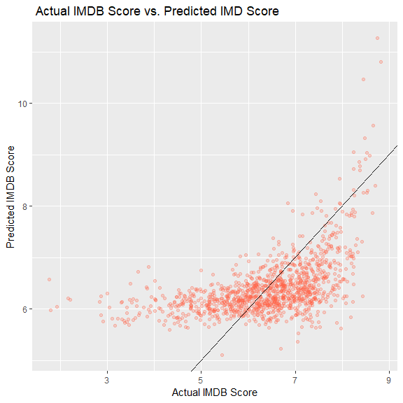
We see non-linear relation between the scores, but overall it has an upward trend. But we see lots of variation in predicted scores. It is possible that this model is not taking into account some other features, whch are affecting IMDB score. As observed, we have only included numeric features in our model so far. It is worthwhile considering categorical features too while predicting IMDB score.
But before we consider categorical features, it might be useful to consider our method of imputing. Presently, we are imputing numeric variables with mean of numeric variables. If the numeric variable has a right skewed distribution then imputing every missing value with mean seems not to be a wise choice. In our case, gross income is heavily right skewed. So it makes sense to impute numeric variables with its median.


### Model 2
Next, we impute missing numeric variables with its median and redefine new variables and follow similar procedure except that we add a categorical variable, content rating.


```r
movie_impute_median <- as.data.frame(lapply(movie_select,impute_median))
movie_impute_median <- as.data.frame(lapply(movie_impute_median,impute_category))
```


```r
movie_impute_median <- movie_impute_median %>%
  mutate(movie_facebook_likes_norm = (movie_facebook_likes-mean(movie_facebook_likes))/sd(movie_facebook_likes),
           num_user_votes_norm = (num_voted_users-mean(num_voted_users))/sd(num_voted_users),         actor_3_facebook_likes_norm=(actor_3_facebook_likes-mean(actor_3_facebook_likes))/sd(actor_3_facebook_likes),
         gross_norm=(gross_income-mean(gross_income))/sd(gross_income),
         director_facebook_likes_norm=(director_facebook_likes-mean(director_facebook_likes))/sd(director_facebook_likes),
         actor_1_facebook_likes_norm=(actor_1_facebook_likes-mean(actor_1_facebook_likes))/sd(actor_1_facebook_likes))
```


```r
set.seed(101)
sample <- sample.int(nrow(movie_impute_median), size = floor(.75*nrow(movie_impute_median)), replace = F)
training_median <- movie_impute_median[sample, ]
testing_median  <- movie_impute_median[-sample, ]
```


```r
linmod2 <- lm(imdb_score~movie_facebook_likes_norm+num_user_votes_norm +
              movie_age  +  duration  +  actor_3_facebook_likes_norm +     actor_1_facebook_likes_norm + Budget_millions+ gross_norm+
                content_rating,data=training_median)
summary(linmod2)
```

```
## 
## Call:
## lm(formula = imdb_score ~ movie_facebook_likes_norm + num_user_votes_norm + 
##     movie_age + duration + actor_3_facebook_likes_norm + actor_1_facebook_likes_norm + 
##     Budget_millions + gross_norm + content_rating, data = training_median)
## 
## Residuals:
##     Min      1Q  Median      3Q     Max 
## -4.1175 -0.4746  0.1117  0.6237  2.7707 
## 
## Coefficients:
##                               Estimate Std. Error t value Pr(>|t|)    
## (Intercept)                  5.2815868  0.1305310  40.462  < 2e-16 ***
## movie_facebook_likes_norm    0.1173529  0.0189429   6.195 6.49e-10 ***
## num_user_votes_norm          0.4384748  0.0234993  18.659  < 2e-16 ***
## movie_age                    0.0157525  0.0013940  11.300  < 2e-16 ***
## duration                     0.0099386  0.0007646  12.998  < 2e-16 ***
## actor_3_facebook_likes_norm -0.0548486  0.0172587  -3.178  0.00150 ** 
## actor_1_facebook_likes_norm  0.0510199  0.0196746   2.593  0.00955 ** 
## Budget_millions             -0.0007058  0.0002858  -2.470  0.01355 *  
## gross_norm                  -0.1137552  0.0225216  -5.051 4.62e-07 ***
## content_ratingNC-17         -0.0738676  0.2720559  -0.272  0.78601    
## content_ratingPG            -0.1439458  0.1137020  -1.266  0.20560    
## content_ratingPG-13         -0.3073671  0.1111034  -2.766  0.00570 ** 
## content_ratingR             -0.0484659  0.1099630  -0.441  0.65942    
## content_ratingNA             0.1152707  0.1277001   0.903  0.36676    
## ---
## Signif. codes:  0 '***' 0.001 '**' 0.01 '*' 0.05 '.' 0.1 ' ' 1
## 
## Residual standard error: 0.9342 on 3581 degrees of freedom
## Multiple R-squared:  0.294,	Adjusted R-squared:  0.2915 
## F-statistic: 114.7 on 13 and 3581 DF,  p-value: < 2.2e-16
```

#### Analysis of Model 2
The $R^2$ for model 2 has improved slightly. Lets check the rmse on training as well as test set.


```
## [1] 0.9323336
```

Next, we perform the same computation on test set.

```
## [1] 0.9498033
```
There is a slight improvement in $R^2$ but our model is still capturing only approx 30 percent of variation in the data. Maybe, we can think about training new models now. One of the options is using Support Vector Regressor(SVR).

### Model 3
To implement SVR, we place an upper bound on the prediction error. The implementation is similar to SVM, with the only difference being, specify an upper bound on error, $\epsilon$. 


```
## 
## Call:
## svm(formula = imdb_score ~ movie_facebook_likes_norm + num_user_votes_norm + 
##     movie_age + duration + actor_3_facebook_likes_norm + gross_norm + 
##     actor_1_facebook_likes_norm + Budget_millions, data = training_median, 
##     type = "eps-regression", kernel = "linear")
## 
## 
## Parameters:
##    SVM-Type:  eps-regression 
##  SVM-Kernel:  linear 
##        cost:  1 
##       gamma:  0.125 
##     epsilon:  0.1 
## 
## 
## Number of Support Vectors:  3214
```
For this model, we have used default values for parameters,$\epsilon$ and $C$. Let us compare the performance of this model on training and test sets.


```
## [1] 0.9534496
```

The training error is comparable to case of linear regression. Let us check the performance on test set.


```
## [1] 0.9663305
```


Next, we use caret to implement SVR as well as do cross validation on the cost parameter, $C$. 

### Model 4
First, we do the imputation using median of numeric variables, followed by normalizing it.


```r
movie_impute_median <- as.data.frame(lapply(movie_select,impute_median))
movie_impute_median <- as.data.frame(lapply(movie_impute_median,impute_category))
```


```r
movie_impute_median <- movie_impute_median %>%
  mutate(movie_facebook_likes_norm = (movie_facebook_likes-mean(movie_facebook_likes))/sd(movie_facebook_likes),
           num_user_votes_norm = (num_voted_users-mean(num_voted_users))/sd(num_voted_users),         actor_3_facebook_likes_norm=(actor_3_facebook_likes-mean(actor_3_facebook_likes))/sd(actor_3_facebook_likes),
         gross_norm=(gross_income-mean(gross_income))/sd(gross_income),
         director_facebook_likes_norm=(director_facebook_likes-mean(director_facebook_likes))/sd(director_facebook_likes),
         actor_1_facebook_likes_norm=(actor_1_facebook_likes-mean(actor_1_facebook_likes))/sd(actor_1_facebook_likes))
```
This is followed by splitting the dataset.


```r
set.seed(101)
sample <- sample.int(nrow(movie_impute_median), size = floor(.75*nrow(movie_impute_median)), replace = F)
training_median <- movie_impute_median[sample, ]
testing_median  <- movie_impute_median[-sample, ]
```
Next, we implement cross validation to get an optimum value of the parameter $C$. We use the $k$ fold validation method to this end.


```r
tune_control <- tune.control(random = FALSE, nrepeat = 1, repeat.aggregate = mean,sampling = "cross", sampling.aggregate = mean,
sampling.dispersion = sd,
cross = 10, best.model = TRUE,performances = TRUE, error.fun = NULL)
```

Now we implement training as well as cross validation in the same step. We also plan to provide the ranges of parameters in this ```train()``` function.


```r
tunedsvr <- tune(svm,train.x=training_median[,c('movie_facebook_likes_norm','num_user_votes_norm',
                               'actor_3_facebook_likes_norm','gross_norm','director_facebook_likes_norm',
                            'actor_1_facebook_likes_norm')], train.y =training_median[,c('imdb_score')], ranges = list( cost = 2^seq(0,2,0.1)), predict.func = predict,
     tunecontrol = tune.control())
```

Once the training is completed, we access the performance for each value of the parameter, $C$. The best performance is achieved using the value of $C$ as 1.584.

```r
performance <- tunedsvr$performances

ggplot(performance,aes(cost,error))+
  geom_line()
```

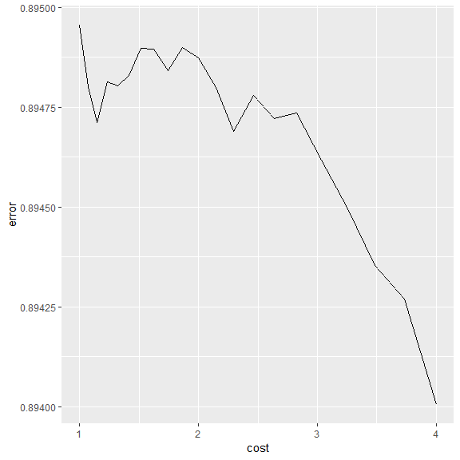
Once we obtain the best model, using ```best.model()```, we apply that model on the testing set, ```testing_median```.


```r
best_svr <- tunedsvr$best.model
score_pred <- predict(best_svr,testing_median[,c('movie_facebook_likes_norm','num_user_votes_norm',
                               'actor_3_facebook_likes_norm','gross_norm','director_facebook_likes_norm',
                            'actor_1_facebook_likes_norm')])
pred_error <- score_pred-testing_median[,c('imdb_score')]
rmse(pred_error)
```

```
## [1] 0.965559
```


### Summary

Here, we performed EDA on the movies dataset, available at IMDB. Initially, we did a deep dive into the dataset and higlighted following relations;

* During the period 2000-2016, the relation between Budget and profit earned is almost linear.

* There does not exist linear relation between IMDB score and number of facebook likes received by a movie. On the contrary, the relationship looks roughly logarithmic in nature.

* Comparing the mean IMDB score, we do not see a direct dependency between the IMDB score and popularity of movie director.

* Similar to number of facebook likes, number of user votes also does not decide IMDB score decisively. The relation between IMDB score and number of votes received is logarithmic.

*  Certain degree of interaction between country and language has been observed in determining IMDB score.

Next, we built a linear model to predict the IMDB score using relevant informaiton from the dataset. Some features, that seem to influence the IMDB score (maybe not so in linear fashion) include Number of User votes, Number of facebook likes Received  by a Movie, Content Rating, Gross Income Generated,
 Movie Duration etc. In the first two models, we used linear regression model. But the root mean square error(rmse) was significantly high. This gives an indication that maybe  we have some interaction between features which is affecting IMDB score. Another possibility is nonlinearity in the relation between predictors and IMD score. 
